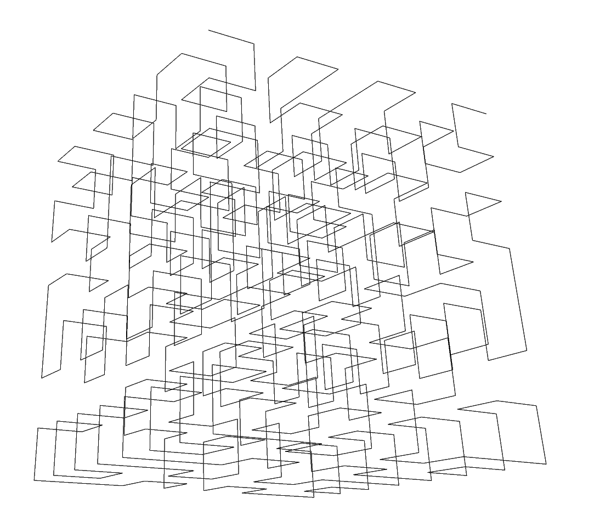

# 3D Hilbert Cube

Draws 3D Hilbert Cube.



Compilation: ```make```

Run: ```./hilbert3D deg pic_len cube_len obs_dist x y z phi psi > output_file```
where
- deg - degree (how many folds)
- pic_len - picture length
- cube_len - cube length
- obs_dist - observer distance
- x, y, z - begin of a curve
- phi - X rotation 
- psi - Y rotation

Example run: ```./hilbert3D 3 100 40 100 2 2 2 30 60```


